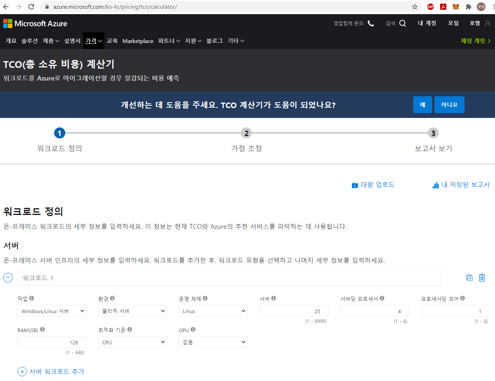

# Azure 개요
[Test Exam : https://www.examtopics.com/exams/microsoft/az-900/]

# 목차
1) Azure Global Infra
2) Azure 리소스에 대한 논리적인 구분
3) Azure 지원 Plan
4) Azure 서비스 수명주기
5) Azure 주요 용어

## 1) Azure Global Infra
    
   - Geography [지리] : 중앙아시아 / 아시아 / 유럽/ 미주 4개로 나눔
   - Region [지역] : 사용자는 지역까지만 선택할 수 있다. [한국(중부), 한국(남부)...]
      * 지역은 불바다가 될 수 있으니, 각각의 Region은 Paired Region을 가진다.
        [한국 중부 Region <-> 한국 남부 Region]
      * Paired Region은 상호간의 DR을 담당한다.
   - Availability Zones [가용성 영역] : 
      * Azure Region 내에서의 물리적 분리
      * 하나 혹은 그 이상의 데이터 센터로 구성되며, 독립된 전원 및 네트워크를 보유
      * 독립적으로 동작하며, 하나의 가용성 영역에 장애 시, 다른 영역에서 연속적으로 서비스
    - Availability Set [가용성 집합] : 
      * WEB-WAS-DB 티어의 묶음 2개가 2개의 VM에 중복되면 1개의 VM이 내려가도 문제가 없다.
      * WEB-WAS-DB 티어의 묶음 2개가 2개의 VM에 중복되고, 각 VM이 서로다른 가용성 영역에 있으면 더 안전하다.

## 2) Azure 리소스에 대한 논리적인 구분
    
   * Azure Subscription [구독] : 
      * Cost, Access Control, Technical Limit의 기본 단위  
      * Azure Account는 한개 혹은 여러개의 구독을 가질 수 있다.  
      * 구독의 종류 :  
         -> 무료 : Azure Free Account [30일 동안 200불 한도의 무료 계정]  
         -> 종량제 : Pay as you go  
         -> 학생 : 난 아님  
      
   * 비용계획 및 관리 : 
      * Azure의 고객유형 :   
         -> 기업고객 : 연간 협상된 금액을 지출하는 계약을 기반  
         -> 일반고객 [웹 구매] :   
         -> 클라우드 솔루션 공급자 (CSP) : Microsoft 파트너  
         
   * 비용에 영향을 미치는 요인 :  
      * Resource Type : 배포하는 리소스의 유형에 따라 가격책정 방식이 다름  
      * Customer Type : Enterprise, Web Direct, Partner 고객에 따라 가격이 다름  
      * Location : 리소스를 제공하는 Region에 따라 비용이 다름  
      
   * 청구영역 : 
      * Azure로 들어오는 인바운드 데이터는 무료 [대역폭]  
      * Azure 아웃바운드 데이터 전송의 경우 과금  
      * Region의 경우 지리와는 달리 청구를 목적으로 분할된 것으로 Region 내부의 데이터 전송과 Region 사이의 데이터 전송의 가격 다름  
      * 가격 계산기 : Azure 리소스 구성에 따른 비용을 예상하는데 사용  
      * 총소유비용 [TCO] 계산기 : 온프레미스 환경을 입력하여 Azure 마이그에 따른 총 연간 비용을 견적으로 볼 수 있음  
        [TCO : Total Cost of Ownership]  

 

 

    
   * Azure Cost Management [비용관리] : 
      * 예산설정 및 경고알림 설정 기능 제공  
      
   * 비용 최소화 방안 : 
      * 가격 계산기 혹은 TCO 계산기로 예상 비용 확인  
      * Azure Advisor를 통해 사용량 모니터링  
      * 지출 한도를 지정  
      * Azure Reserved Resource 혹은 Azure Hybrid Benefit을 활용  
      * 저렴한 Region 선택  
      * 태그를 적용하여 비용별 사용자를 식별   
      

## 3) Azure 지원 Plan
    
   * 기술지원 옵션 5개 : 높은 옵션일수록 빠른 지원 [응답시간 제한이 짧아짐] 
      * Basic : 기술지원 X
      * Developer : 메일을 통한 기술지원
      * Standard : 전화를 통한 기술지원
      * Professional : 아키텍쳐 지원?
      * Premier : 아키텍쳐 지원
   
       
       
       
## 4) Azure 서비스 수명주기
      
   * Azure에서 제공하는 서비스는 Preview / GA 단계로 나뉜다.  
     [Preview : 미리보기 / GA : General Availability]  
      * Preview : 평가 목적으로 Azure 기능의 미리 보기를 제공 [싸다 / 기술지원X / SLA X]  
         -> 비공개 미리 보기 : 특정 Azure 사용자에게만 공개   
         -> 공개 미리 보기 : 모든 Azure 사용자에게 공개  
         [Azure 포탈에도 Preview가 있다. (https://preview.portal.azure.com)]  
      * GA [General Availability] :   
         -> 기능이 성공적으로 검증되면, Azure의 기본 제품으로서 고객에게 제공  
      * Azure 업데이트 사이트에서 다양한 기능에 대한 업데이트 소식을 실시간 모니터링 가능  
      
      
## 5) Azure 주요 용어
      
   * Management Group [관리 그룹]  
      * 조직에 구독이 많을경우 구독에 대한 엑세스 및 정책을 관리하기 위한 방안  
      * Azure 관리 그룹을 구독 상위 수준의 범위를 제공  
      * 관리 그룹이라는 컨테이너에 구독을 구성하고 거버넌스 조건을 관리 그룹에 적용  
      * 관리 그룹에 속하는 모든 구독은 관리 그룹에 적용되는 조건을 자동으로 상속  
      * 단일 관리 그룹 내의 모든 구독은 동일한 Azure Active Directory 테넌트를 신뢰해야 한다.  
      * 관리 그룹은 트리 구조를 이루며, 상위 관리 그룹에 적용된 정책은 하위 항목에 상속된다.  

      * EX) "프로덕션" 관리그룹에 VM 생성이 가능한 지역을 제한하는 정책을 적용할 경우  
         -> 지리적 영역1 / 지리적 영역2 2개 관리 그룹에 포함된 모든 구독에 정책이 적용된다.  
         
   
   

