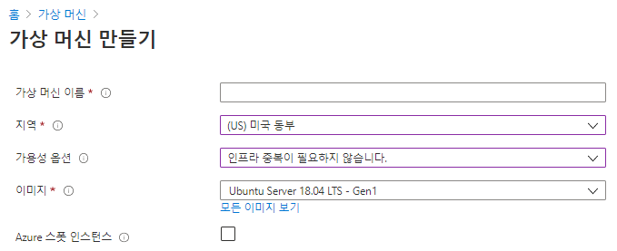
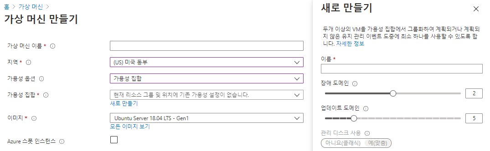
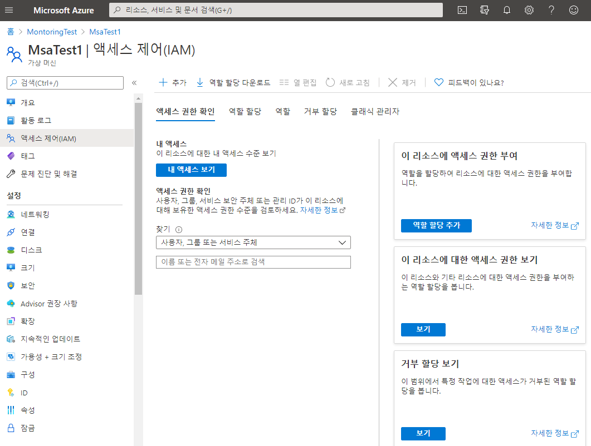
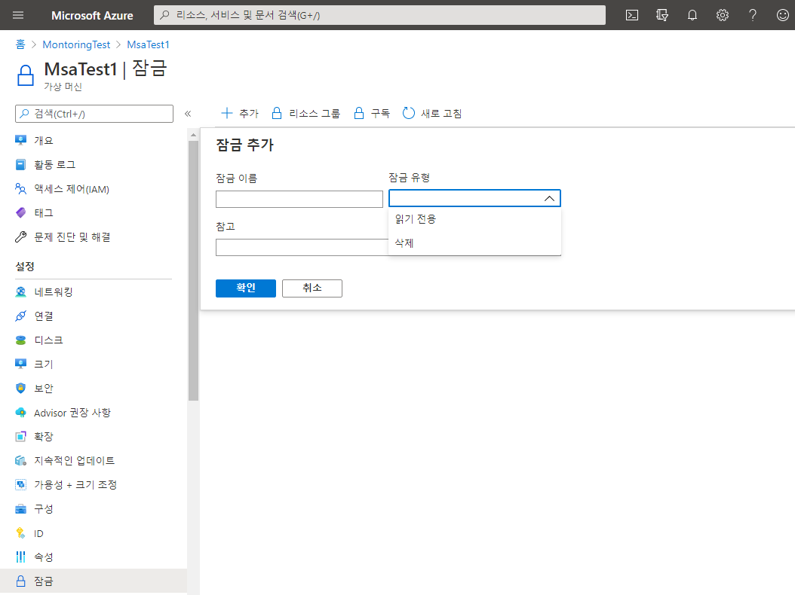
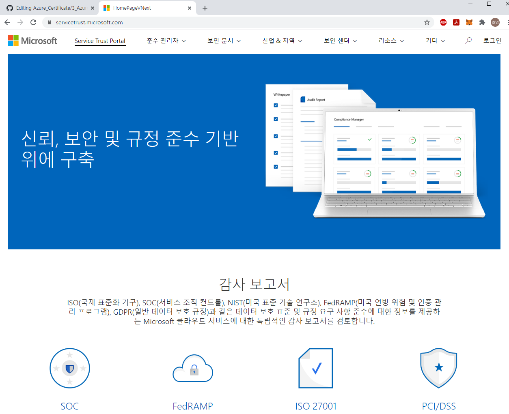

# Azure Components   

# 목차
1) Azure VM
2) VM scale sets
3) Azure App Services
4) Azure Functions
5) Container services
6) Azure Network Services
7) Azure Storage Services
8) Azure Database Services
9) Azure 솔루션
10) Azure 관리도구
11) Azure Identity 서비스
12) Azure 보안도구
13) Azure 가버넌스 방법론
14) Azure 액세스 제어 RBAC
15) Azure 모니터링 및 관리
16) 개인정보 보호

## 1) Azure VM [IaaS]

   - 클라우드 기반 응용 프로그램을 실행하기 위한 온디맨드 컴퓨팅 서비스
   - VM을 끄면, VM에 할당된 Computing Resource가 릴리즈되어 비용 절감 가능 [Disk storage에 대해서는 비용 청구]
   
   - 가상머신 생성 시 가용성 옵션 : 단일 VM 이상의 가용성을 확보하기 위한 옵션  
   
      * 인프라 중복이 필요하지 않습니다. : 단일VM으로 생성  
      
      * 가용성 집합(Availability Sets) : VM 중복성 및 가용성을 제공하는 데이터 센터 구성 방법  
         -> 가용성 집합에 포함된 각각의 가상 머신을  업데이트  도메인 및 장애 도메인에 할당   
	 -> 장애 도메인(Fault Domain) : 장애 도메인은 공통 전원과 네트워크 스위치를 공유하는 가상 머신 그룹 [ex. 서버랙]   
	 -> 업데이트 도메인(Update Domain) : 동시에 재부팅할 수 있는 가상 머신 및 기본 물리적 하드웨어 그룹   
	        [WEB-WAS-DB 세트와 같은 수평적 개념]   
	 -> 가용성 집합은 2개 이상의 FD와 2개 이상의 UD로 구성하여 가용성을 높인다.    
	 
      * 가용성 영역(Availability Zones) : 데이터 센터에 대한 장애를 방지하기 위해 여러 데이터 센터를 묶어 분산  
         -> 가용성 영역을 선택할 경우, FD/UD 설정은 Azure가 알아서 운영한다.  
	 -> Azure 지역 내의 고유한 물리적 위치  
            * 각 영역은 독립된 전원, 냉각 및 네트워킹을 갖춘 하나 이상의 데이터 센터로 구성    
	    * 복원력을 보장하기 위해 활성화된 모든 지역(Region)에서 최소한 세 개의 별도 영역(Zone)이 필요    
	    * 영역 중복 서비스는 단일 지점 오류에서 보호하기 위해 가용성 영역에 애플리케이션 및 데이터를 복제   
	 
      * VM 설정별 SLA 수준 
         -> 프리미엄 SSD를 데이터 디스크로 사용하는 단일 인스턴스 가상 VM에 대해서는 99.9% 수준의 SLA 보장
	 -> Availability Sets [가용성 집합]을 활용할 경우 99.95% 수준의 SLA 보장
	 -> Availabiliyt Zone [가용성 영역]을 활용할 경우 99.99% 수준의 SLA 보장
	 
 
	
 
	
 
 
 
## 2) VM scale sets [vm 확장집합]

   - 자동 확장 지원을 위해 설계된 서비스
   - VM 인스턴스의 수는 요구 또는 정의된 일정에 따라 자동으로 늘리거나 줄일 수 있다.
   - 확장 집합을 사용하면 동일한 기본 OS 이미지 및 구성에 모든 VM 인스턴스가 만들어진다.
   - 고가용성 및 애플리케이션 복원력 제공
   - 리소스 수요 변화에 따라 자동으로 애플리케이션 크기 조정

## 3) Azure App Services [PaaS]

   - Azure App Service를 사용하면 인프라를 관리할 필요 없이, 서비스를 빌드 및 호스팅할 수 있다.
   - 자동 크기 조정 및 고가용성을 제공하고, Windows 및 Linux를 모두 지원
   - GitHub, Azure DevOps에서 자동화된 배포를 연계할 수 있다.
   
   
## 4) Azure Functions [서버리스 컴퓨팅]

   - 이벤트 기반으로 컴퓨팅을 수행할 수 있는 서비스
   - 시스템 논리를 즉시 사용할 수 있는 코드 블록으로 구현할 수 있다.
   - 요청이 증가함에 따라 필요한 만큼의 리소스 및 함수 인스턴스를 사용한다.
   
## 5) Container services

   - 경량으로 동적 생성, 확장 및 중지되도록 설계된 가상환경
   - Azure Container Instance [PaaS] : 컨테이너를 업로드 하면 바로 수행할 수 있다.
   - Azure Kubernetis service [PaaS] : 많은 수의 컨테이너를 관리하기 위한 컨테이너 오케스트레이션 서비스
   
   
## 6) Azure Network Services

   - Azure Virtual Network : 리소스 간 안전한 통신을 제공
   - Azure Load Balancer : 
   - VPN Gateway : 온 프레미스와 가상 네트워크 통신을 안전하게 연결
   - Azure Application Gateway : 웹 응용 프로그램에 대한 트래픽을 관리할 수 있는 웹 트래픽 로드 밸런서
   - Content Delivery Network : 사용자에게 웹 콘텐츠를 효율적으로 전달할 수 있는 분산 서버 네트워크
   

## 7) Azure Storage Services
   * 데이터 형태  
      * 정형 데이터 : 정해진 스키마가 있고, 데이터 필드 속성을 유지  
      * 반정형 데이터 : 변경 가능성이 있는 스키마로 상대적으로 덜 구조화 된 필드 및 속성 [Html, json]  
      * 비정형 데이터 : 스키마나 데이터 구조가 정해지지 않음 [이미지, 비디오]  
       
   * IaaS 서비스 :   
      * Disk  
      * Files [여러개의 VM에서 NSA형식으로 접근하여 사용 가능]  
   * PaaS 서비스 :   
      * Containers [Blob스토리지, 비정형 데이터]  
      * Tables : NoSQL 데이터 저장 [key/value 형식의 기본적인 형태]  
      * Queues : 메시지 저장 및 처리  
      
   * 스토리지 계정 (Storage Account) [IaaS] :  
      * Blob, 파일, 큐, 테이블, 디스크 등, 모든 Azure Storage 데이터 개체가 포함  
      * HTTP 또는 HTTPS를 통해 전 세계 어디에서 나 액세스  
      * 복제 옵션 :   
         -> 로컬 중복 스토리지 (LRS) : 단일 데이터 센터 내에서 데이터를 3 copy로 보관  
         -> 영역 중복 스토리지 (ZRS) : 기본 지역에 있는 3개의 Azure 가용성 영역에서 데이터를 동기적으로 복사  
         -> 지역 중복 스토리지 (GRS) : LSR을 사용하여 기본 지역의 단일 물리적 위치에 3 copy, 보조 지역의 단일 물리적 위치에 데이터를 비동기적으로 복사    
         -> 지역 영역 중복 스토리지 (GZRS) :  
      * Data Lake Storage Gen2 :   
         -> 계층 구조 네임스페이스 : 사용으로 체크하면 빅데이터 처리용도     
      

## 8) Azure Database Services
**[Database Component의 경우, patch, backup 등의 기반 관리가 필요하기에 모두 PaaS]**
   * Azure Cosmos DB : PaaS형식의 nosql 저장소 
   * Azure SQL Database : 가장 최신 버전의 MS SQL Server RDBMS를 지원 
   * Azure Database Migration : 다양한 원천 데이터 소스로부터 클라우드로의 데이터 이관을 도와주는 관리형 데이터 이관 서비스 
   

## 9) Azure 솔루션 

   * IOT 솔루션 : 
      * Azure IoT Central : IoT서비스 구축을 위한 SaaS 형태의 관리형 서비스  
        [디바이스 연결, 모니터링 그리고 관리 및 확장 지원]   
      * Azure IoT Hub : 클라우드 PaaS 기반의 IoT관리 플랫폼 서비스  
      
   * BigData 솔루션 : 
      * Azure Synapse Analytics : 수십 페타의 데이터를 MPP기반으로 빠르게 처리 및 온디맨드 분석을 지원하여 인사이트를 제공  
        [DW + Spark, MPP : Massive Parallel Processing]  
      * Azure HDInsight : 오픈소스 Hadoop 기반의 관리형 서비스 제공
        [쉽고 빠르게 데이터 처리가 가능, 호튼웍스 버전] 
	
   * AI 솔루션 : 
      * Azure Machine Learning service : SDK기반으로 손쉽게 코드를 작성하고 train, test, deploy가 가능한 플랫폼 제공  
        [코드 기반의 머신러닝 서비스] 
      * Azure Machine Learning Studio : GUI 기반으로 코드 없이 손쉽게 ML모델을 테스트 할 수 있는 플랫폼 제공  
        [GUI 기반 머신러닝 서비스] 
	
   * DevOps 솔루션 : 
      * Azure DevOps services : 클라우드 기반 통합 개발 협업 서비스 (CI/CD)  
        [파이프라인, Git저장소, 오픈소스 연계 등을 지원]   
      * Azure DevTest Labs : 쉽고 빠르게 재사용 가능한 템플릿을 통해 개발코드에 대한 테스트 가능  
        [개발 테스트 솔루션] 
      
   * 서버리스 :  
      * Azure Functions : 서비스를 위한 코드에 집중  
        [인프라 및 플랫폼에서 자유도 확보]   
      * Azure Logic Apps : 작업 및 비지니스 프로세스를 자동화하고 오케스트레이션 할 수 있는 서비스 제공  
        [UI기반으로 Workflow 구성 가능]  
      * Azure Event Grid : 이벤트 라우팅 서비스 
	 

## 10) Azure 관리도구

   * Azure Portal : GUI기반 
   * Azure PowerShell / Azure CLI : 별도 클라이언트 설치 필요  
   * Azure Cloud Shell : 클라이언트 설치 없이 브라우저를 통해 CLI접근  
     [Azure Portal에서 CMD창과 유사한 화면을 띄울 수 있다. PowerShell/Bash 중 선택 가능]  
   * Azure Mobile App :  
   * Azure REST API :  
   * Azure Advisor : Best Practice 기반의 개인화된 권장 사항 제공  
     [무료로 제공되는 기능으로 성능/보안/가용성/비용적인 측면의 추천을 확인 할 수 있다.]  
   * Azure Quick Start Template : 미리 만들어진 템플릿으로 코드 형식은 JSON이다.  

## 11) Azure Identity 서비스

   * Azure Active Directory : 인증 및 권한    
      * 인증 [Authentication] : 사람 또는 서비스를 식별   
      * 권한 [Authorization] : 인증된 사용자에 대한 엑세스 수준을 결정 
      * AAD는 클라우드 기반의 신원확인 및 접근관리 서비스  
         -> B2B, B2C ID서비스 및 디바이스 관리  
	 -> 다단계 인증 [Azure Multi-Factor Authentication]  
	    [아래의 3가지 중 두개 이상의 요소를 요구하여 신원확인에 대한 추가 보안을 제공]  
	    [Something you know]  
	    [Something you possess]  
	    [Something you are]  
	   
	   
## 12) Azure 보안도구 
      
   * Azure Security Center [보안센터]
      * Azure 및 온프레미스 서비스에 대한 위협 보호 기능을 제공하는 모니터링 서비스  
      * 보안 권장사항을 제공  
      * 장애 시 감지/평가/진단 단계에서 보안센터를 사용 [실제 보안개선은 알아서 해야함]  
  
   * Azure Key Vault [키 자격증명]  
      * 응용 프로그램 보안을 중앙 집중식 클라우드에 저장하여 엑세스 권한을 안전하게 제어  
        [Key Vault에 대한 접근로그를 관리]  
      * 비밀번호 관리/ 키 관리 / 인증서 관리 / 하드웨어 보안모듈 등을 지원  
      
   * Azure Information Protection [AIP 정보보호]  
      * 레이블을 적용하여 문서 및 전자 메일을 분류하고 보호  
      * 관리자가 정의한규칙 및 조건을 자동으로 사용  
      * 문서보안/이글아이 솔루션처럼 권한 부여를 통해 문서의 내용을 보호  
        [특정 사용자 그룹만 열람 가능, 전화번호 패턴에 대한 마스킹 처리]  
        [Key Vault에 대한 접근로그를 관리]   
      * 비밀번호 관리/ 키 관리 / 인증서 관리 / 하드웨어 보안모듈 등을 지원    
       
   * Azure Advanced Threat Protection [ATP 고급위협보호]  
      * 지능형위쳡, 손상된 ID 및 악의적인 내부자 작업을 식별/탐지 및 조사하기 위한 클라우드 기반의 보안 솔루션  
      * Azure ATP :  
         -> Portal : 의심스러운활동을 모니터링하고 대응  
	 -> Sensors : 도메인 컨트롤러에 직접 설치  
	 -> Cloud Service : Azure 인프라에서 실행  
      
## 13) Azure 가버넌스 방법론
            
   * Policy [정책] : 
      * Azure 리소스에 대한 규칙을 적용, 회사표준 및 서비스 수준 계약 준수를 돕는다.  
      * 정책을 준수하지 않는 Azure 리소스를 평가 및 식별   
      * 정책 정의 생성-> 리소스에 정책 할당 -> 평가 검토    

   * Policy Initiatives : 
      * Initiatives는 정책들의 묶음 [여러 정책을 묶어 한번에 적용 가능]  
      * 정책과  동일하게 정의/할당 단계가 있다.  

   * Policy [정책] 예시 : 
      * 허용되는 위치와 같이 이미 정의된 정책을 사용하여, 특정 Region에만 리소스 생성이 가능하도록 제한을 둘 수 있다.  
      * 정확히는 정책을 만들지는 않았지만 할당을 한 것이다.  

## 14) Azure 액세스 제어 RBAC 

   * Azure 리소스에대한 세분화된 엑세스 관리 [RBAC : Resource Based Access Control]  
   * 팀 내에 책임을  분리하여 그 작업을 수행하는데 필요한 사용자에게만 적당한 권한을 부여한다.    
   * Azure 포탈  및 리소스로의 접근을 허용 및 거부  
   
   * Azure Portal에서 VM화면 왼편 메뉴에 엑세스 제어가 있다.    
      * 해당 리소스에 대한 RBAC 설정 가능  
      * 리소스 그룹에 대한 RBAC 설정도 가능   

 

   * Resource Locks [잠금]    
      * 실수로 삭제되거나 수정되지 않도록 Azure 리소스를 보호  
      * Azure Portal에서 구독, 리소스 그룹 또는 개별 리소스 수준에서 잠금을 관리 (상속 지원)  
         -> CanNotDelete : 읽기(O)/업데이트(O)/삭제(X)   
         -> ReadOnly : 일기(O)/업데이트(X)/삭제(X)  

 

   * Azure Blueprints   
      * Azure 리소스 및 정책들을 즉시 재생성 할 수 있도록, 재사용 가능한 환경 정의를 만들 수 있다.  
         -> 기본 제공 도구 및 아티팩트를 사용하여 배포를 감사하고 추적하고 규정 준수를 유지  
	 -> Blueprint를 특정 Azure DevOps 빌드 아티팩트 및 릴리스 파이프라인과 연결하여 엄격한 추적을 수행  
	 

## 15) Azure 모니터링 및 관리

   * Tag : 
      * Azure 리소스에 대한 메타 데이터 지원   
      * Key-Value 쌍으로 구성되고 논리적으로 리소스를 분류하기 위해 활용  
      * 청구 혹은 관리용으로 데이터 분석에 용이 [어떤 놈이 얼마 썼냐]  

   * Azure Monitor : 
      * 클라우드 및 온프레미스 환경에서 원격 데이터를 수집/분석/활용하여 애플리케이션의 가용성과 성능을 극대화  
         -> Metrics / Logs 형식의 데이터 수집  
	 -> 수집된 데이터에 대한 분석/표시/알람  
	 -> 쿼리 기반으로 분석 지원 [Azure Analytics]  

   * Azure Service Health : 
      * Azure Status : 전체 서비스의 대략적인 상태를 확인할 수 있다. [Region별 문제]  
      * Service Health : 개인화된 대시보드 및 사용하고 있는 리전별 서비스 상태  
         -> 내가 Azure에 배포한 모든 자원에 대한 상태확인 가능  
      * Resource Health : 각각의 리소스에 대한 디테일한 상태정보    

## 16) 개인정보 보호

   * Trust Center :  
   * Service Trust Portal : Azure와 관련된 다양한 감사 보고서 열람  

 

