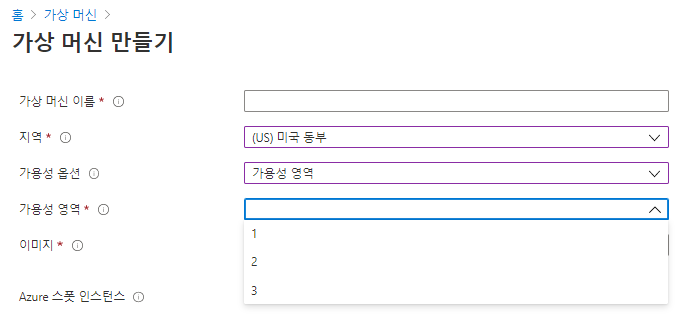

# Azure Components   

# 목차
1) Azure VM
2) VM scale sets
3) Azure App Services
4) Azure Functions
5) Container services
6) Azure Network Services
7) Azure Storage Services
8) Azure Database Services
9) Azure 솔루션
10) Azure 관리도구
11) Azure Identity 서비스
12) Azure 보안도구
13) Azure 가버넌스 방법론
14) Azure 액세스 제어 RBAC
15) Azure 모니터링 및 관리
16) 개인정보 보호

## 1) Azure VM [IaaS]

   - 클라우드 기반 응용 프로그램을 실행하기 위한 온디맨드 컴퓨팅 서비스
   - VM을 끄면, VM에 할당된 Computing Resource가 릴리즈되어 비용 절감 가능 [Disk storage에 대해서는 비용 청구]
   
   - 가상머신 생성 시 가용성 옵션 : 단일 VM 이상의 가용성을 확보하기 위한 옵션  
   
      * 인프라 중복이 필요하지 않습니다. : 단일VM으로 생성  
      
      * 가용성 집합(Availability Sets) : 단일 데이터 센터 안에서 랙 단위를 묶어서 분신  
         -> 1개 VM이 올라가 있는 랙에 문제가 있어도, 다른 랙의 VM이 커버  
	 -> 장애 도메인(Fault Domain) : 동일한 전원과 네트워크 스위치를 사용하는 도메인으로 물리적인 랙으로 볼 수 있다.  
	 -> 업데이트 도메인(Update Domain) : 동시에 유지관리를 진행하거나, 부팅될 수 있는 논리적 그룹 
	    [WEB-WAS-DB 세트와 같은 수평적 개념]  
	 -> 가용성 집합은 2개 이상의 FD와 2개 이상의 UD로 구성하여 가용성을 높인다.   
	 
      * 가용성 영역(Availability Zones) : 데이터 센터에 대한 장애를 방지하기 위해 여러 데이터 센터를 묶어 분산  
         -> 가용성 영역을 선택할 경우, FD/UD 설정은 Azure가 알아서 운영한다.  
	 -> Azure 지역 내의 고유한 물리적 위치  
             - 각 영역은 독립된 전원, 냉각 및 네트워킹을 갖춘 하나 이상의 데이터 센터로 구성  
	     - 복원력을 보장하기 위해 활성화된 모든 지역(Region)에서 최소한 세 개의 별도 영역(Zone)이 필요  
	     - 영역 중복 서비스는 단일 지점 오류에서 보호하기 위해 가용성 영역에 애플리케이션 및 데이터를 복제  

   	

   	

  	
 
 
## 2) VM scale sets [vm 확장집합]

   - 자동 확장 지원을 위해 설계된 서비스
   - VM 인스턴스의 수는 요구 또는 정의된 일정에 따라 자동으로 늘리거나 줄일 수 있다.
   - 확장 집합을 사용하면 동일한 기본 OS 이미지 및 구성에 모든 VM 인스턴스가 만들어진다.
   - 고가용성 및 애플리케이션 복원력 제공
   - 리소스 수요 변화에 따라 자동으로 애플리케이션 크기 조정

## 3) Azure App Services [PaaS]

   - Azure App Service를 사용하면 인프라를 관리할 필요 없이, 서비스를 빌드 및 호스팅할 수 있다.
   - 자동 크기 조정 및 고가용성을 제공하고, Windows 및 Linux를 모두 지원
   - GitHub, Azure DevOps에서 자동화된 배포를 연계할 수 있다.
   
   
## 4) Azure Functions [서버리스 컴퓨팅]

   - 이벤트 기반으로 컴퓨팅을 수행할 수 있는 서비스
   - 시스템 논리를 즉시 사용할 수 있는 코드 블록으로 구현할 수 있다.
   - 요청이 증가함에 따라 필요한 만큼의 리소스 및 함수 인스턴스를 사용한다.
   
## 5) Container services

   - 경량으로 동적 생성, 확장 및 중지되도록 설계된 가상환경
   - Azure Container Instance [PaaS] : 컨테이너를 업로드 하면 바로 수행할 수 있다.
   - Azure Kubernetis service [PaaS] : 많은 수의 컨테이너를 관리하기 위한 컨테이너 오케스트레이션 서비스
   
   
## 6) Azure Network Services

   - Azure Virtual Network : 리소스 간 안전한 통신을 제공
   - Azure Load Balancer : 
   - VPN Gateway : 온 프레미스와 가상 네트워크 통신을 안전하게 연결
   - Azure Application Gateway : 웹 응용 프로그램에 대한 트래픽을 관리할 수 있는 웹 트래픽 로드 밸런서
   - Content Delivery Network : 사용자에게 웹 콘텐츠를 효율적으로 전달할 수 있는 분산 서버 네트워크
   

## 7) Azure Storage Services
   * 데이터 형태  
      * 정형 데이터 : 정해진 스키마가 있고, 데이터 필드 속성을 유지  
      * 반정형 데이터 : 변경 가능성이 있는 스키마로 상대적으로 덜 구조화 된 필드 및 속성 [Html, json]  
      * 비정형 데이터 : 스키마나 데이터 구조가 정해지지 않음 [이미지, 비디오]  
       
   * IaaS 서비스 :   
      * Disk  
      * Files [여러개의 VM에서 NSA형식으로 접근하여 사용 가능]  
   * PaaS 서비스 :   
      * Containers [Blob스토리지, 비정형 데이터]  
      * Tables : NoSQL 데이터 저장 [key/value 형식의 기본적인 형태]  
      * Queues : 메시지 저장 및 처리  
      
   * 스토리지 계정 (Storage Account) [IaaS] :  
      * Blob, 파일, 큐, 테이블, 디스크 등, 모든 Azure Storage 데이터 개체가 포함  
      * HTTP 또는 HTTPS를 통해 전 세계 어디에서 나 액세스  
      * 복제 옵션 :   
         -> 로컬 중복 스토리지 (LRS) : 단일 데이터 센터 내에서 데이터를 3 copy로 보관  
         -> 영역 중복 스토리지 (ZRS) : 기본 지역에 있는 3개의 Azure 가용성 영역에서 데이터를 동기적으로 복사  
         -> 지역 중복 스토리지 (GRS) : LSR을 사용하여 기본 지역의 단일 물리적 위치에 3 copy, 보조 지역의 단일 물리적 위치에 데이터를 비동기적으로 복사    
         -> 지역 영역 중복 스토리지 (GZRS) :  
      * Data Lake Storage Gen2 :   
         -> 계층 구조 네임스페이스 : 사용으로 체크하면 빅데이터 처리용도     
      

## 8) Azure Database Services
     **[Database Component의 경우, patch, backup 등의 기반 관리가 필요하기에 모두 PaaS]**
   * Azure Cosmos DB : PaaS형식의 nosql 저장소
   * Azure SQL Database : 가장 최신 버전의 MS SQL Server RDBMS를 지원
   * Azure Database Migration : 다양한 원천 데이터 소스로부터 클라우드로의 데이터 이관을 도와주는 관리형 데이터 이관 서비스
   

