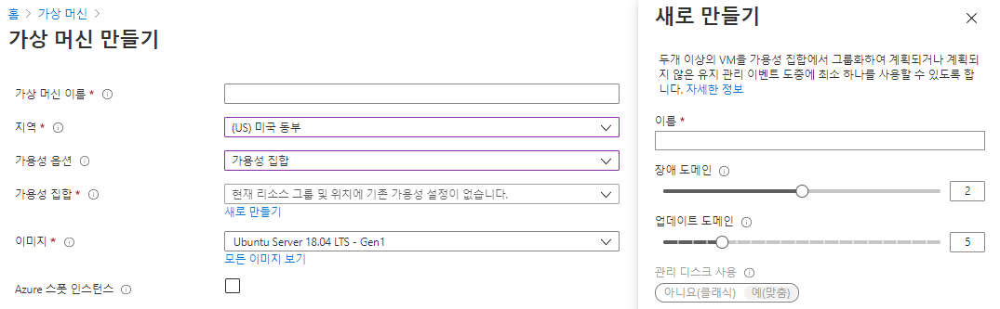

# Azure Components   

# 목차
1) Azure VM
2) VM scale sets
3) Azure App Services
4) Azure Functions
5) Container services
6) Azure Network Services
7) Azure Storage Services
8) Azure Database Services
9) Azure 솔루션
10) Azure 관리도구
11) Azure Identity 서비스
12) Azure 보안도구
13) Azure 가버넌스 방법론
14) Azure 액세스 제어 RBAC
15) Azure 모니터링 및 관리
16) 개인정보 보호

## 1) Azure VM [IaaS]

   - 클라우드 기반 응용 프로그램을 실행하기 위한 온디맨드 컴퓨팅 서비스
   - VM을 끄면, VM에 할당된 Computing Resource가 릴리즈되어 비용 절감 가능 [Disk storage에 대해서는 비용 청구]
   
   - 가상머신 생성 시 가용성 옵션 : 단일 VM 이상의 가용성을 확보하기 위한 옵션
      * 인프라 중복이 필요하지 않습니다. : 단일VM으로 생성
      * 가용성 집합(Availability Sets) : 단일 데이터 센터 안에서 랙 단위를 묶어서 분신
      * 가용성 영역(Availability Zones) : 데이터 센터에 대한 장애를 방지하기 위해 여러 데이터 센터를 묶어 분산
      Azure 지역 내의 고유한 물리적 위치
         * 각 영역은 독립된 전원, 냉각 및 네트워킹을 갖춘 하나 이상의 데이터 센터로 구성
	 * 복원력을 보장하기 위해 활성화된 모든 지역(Region)에서 최소한 세 개의 별도 영역(Zone)이 필요
	 * 영역 중복 서비스는 단일 지점 오류에서 보호하기 위해 가용성 영역에 애플리케이션 및 데이터를 복제
         * 가용성 영역은 장애 도메인(Fault Domain)과 업데이트 도메인(Update Domain)의 조합
	    ex) Azure Region의 3개의 Zone에 VM을 3개를 생성하면, 장애 도메인 3개와 업데이트 도메인 3개에 VM이 분산
      
      

      
   
   ---
   
   ---
   
 
### 1-1. https://start.spring.io/ 접속
   * 아래와 같이 설정 후 GENERATE 클릭

### 1-2. demoA프로젝트를 Eclipse workspace에 압축해제 후 import

### 3-4. Push Local image to Docker Hub

   * Docker Hub에 이미지를 올리고 싶을 경우, 이미지명 형식을 Docker Hub와 맞춰 주어야 한다.
   * 이미지명의 형식은 [Doker Hub계정]/[Docker Hub Repo]:[태그명]
   	
	docker build -t flghdud1234/msa_test:demo .
	docker push flghdud1234/msa_test:demo
   
   * Docker Hub에 업로드한 이미지는 Docker Hub 웹사이트를 통해서도 확인할 수 있다.
   	
