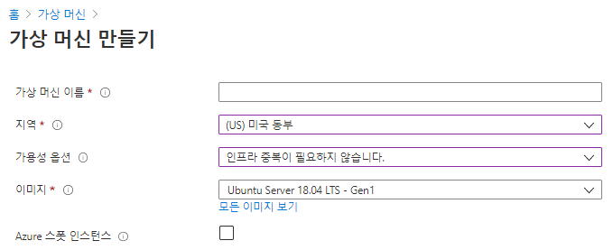

# Azure Components   

# 목차
1) Azure VM
2) VM scale sets
3) Azure App Services
4) Azure Functions
5) Container services
6) Azure Network Services
7) Azure Storage Services
8) Azure Database Services
9) Azure 솔루션
10) Azure 관리도구
11) Azure Identity 서비스
12) Azure 보안도구
13) Azure 가버넌스 방법론
14) Azure 액세스 제어 RBAC
15) Azure 모니터링 및 관리
16) 개인정보 보호

## 1) Azure VM [IaaS]

   - 클라우드 기반 응용 프로그램을 실행하기 위한 온디맨드 컴퓨팅 서비스
   - VM을 끄면, VM에 할당된 Computing Resource가 릴리즈되어 비용 절감 가능 [Disk storage에 대해서는 비용 청구]
   
   - 가상머신 생성 시 가용성 옵션 : 단일 VM 이상의 가용성을 확보하기 위한 옵션  
   
      * 인프라 중복이 필요하지 않습니다. : 단일VM으로 생성  
      
      * 가용성 집합(Availability Sets) : 단일 데이터 센터 안에서 랙 단위를 묶어서 분신  
         -> 1개 VM이 올라가 있는 랙에 문제가 있어도, 다른 랙의 VM이 커버  
	 -> 장애 도메인(Fault Domain) : 동일한 전원과 네트워크 스위치를 사용하는 도메인으로 물리적인 랙으로 볼 수 있다.  
	 -> 업데이트 도메인(Update Domain) : 동시에 유지관리를 진행하거나, 부팅될 수 있는 논리적 그룹 
	    [WEB-WAS-DB 세트와 같은 수평적 개념]  
	 -> 가용성 집합은 2개 이상의 FD와 2개 이상의 UD로 구성하여 가용성을 높인다.   
	 
      * 가용성 영역(Availability Zones) : 데이터 센터에 대한 장애를 방지하기 위해 여러 데이터 센터를 묶어 분산  
         -> 가용성 영역을 선택할 경우, FD/UD 설정은 Azure가 알아서 운영한다.  
	 -> Azure 지역 내의 고유한 물리적 위치  
             - 각 영역은 독립된 전원, 냉각 및 네트워킹을 갖춘 하나 이상의 데이터 센터로 구성  
	     - 복원력을 보장하기 위해 활성화된 모든 지역(Region)에서 최소한 세 개의 별도 영역(Zone)이 필요  
	     - 영역 중복 서비스는 단일 지점 오류에서 보호하기 위해 가용성 영역에 애플리케이션 및 데이터를 복제  

   	

   	

  	
